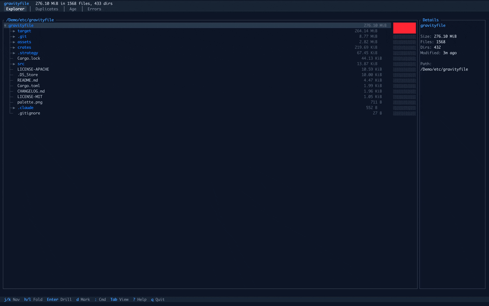

[](LICENSE)
[](https://crates.io/crates/gravityfile)

# gravityfile

> "Where mass accumulates, attention should follow."

A file system analyzer with an interactive TUI, built in Rust.



## Features

- **Interactive TUI** - Beautiful terminal interface with vim-style navigation
- **Parallel Scanning** - Fast directory traversal using `jwalk`
- **Duplicate Detection** - Find duplicate files using BLAKE3 hashing with partial-hash optimization
- **Age Analysis** - Identify stale directories and analyze file age distribution
- **Drill-Down Navigation** - Explore directories without rescanning
- **Command Palette** - Vim-style `:` commands for power users
- **Multiple Themes** - Dark and light theme support
- **Library-First Design** - Use as a library or standalone tool
- **Export Support** - Export scan results to JSON

## Installation

### From crates.io

```bash
cargo install gravityfile
```

### From source

```bash
git clone https://github.com/epistates/gravityfile
cd gravityfile
cargo install --path .
```

This installs two binaries: `gravityfile` and `grav` (short alias).

## Usage

### Interactive TUI (Default)

```bash
gravityfile [PATH]
# or use the short alias:
grav [PATH]
```

Launch the interactive terminal interface to explore disk usage.

### Quick Scan

```bash
gravityfile scan [PATH] [-d DEPTH] [-n TOP]
```

Quick summary of disk usage with tree output.

### Find Duplicates

```bash
gravityfile duplicates [PATH] [--min-size SIZE] [-n TOP]
```

Find duplicate files. Uses a three-phase algorithm:
1. Group files by size
2. Compute partial hash (first + last 4KB)
3. Full BLAKE3 hash for candidates

### Age Analysis

```bash
gravityfile age [PATH] [--stale DURATION]
```

Analyze file ages and find stale directories.

### Export

```bash
gravityfile export [PATH] [-o OUTPUT]
```

Export scan results to JSON.

## TUI Keybindings

### Navigation
| Key | Action |
|-----|--------|
| `j` / `k` | Move down / up |
| `h` / `l` | Collapse / expand directory |
| `g` / `G` | Jump to top / bottom |
| `Enter` | Drill into directory |
| `Backspace` / `-` | Navigate back |
| `Tab` | Switch view |

### Actions
| Key | Action |
|-----|--------|
| `d` | Mark for deletion |
| `x` | Clear all marks |
| `y` | Confirm deletion |
| `i` | Toggle details panel |
| `t` | Toggle theme |
| `r` | Refresh / rescan |
| `?` | Show help |
| `:` | Command palette |
| `q` | Quit |

### Command Palette
| Command | Action |
|---------|--------|
| `:q` | Quit |
| `:cd <path>` | Change directory |
| `:cd ..` | Go to parent |
| `:root` | Go to scan root |
| `:theme` | Toggle theme |
| `:dark` / `:light` | Set theme |
| `:help` | Show help |

## Library Usage

gravityfile is designed as a composable library:

```rust
use gravityfile_scan::{JwalkScanner, ScanConfig};
use gravityfile_analyze::{DuplicateFinder, DuplicateConfig};

// Scan a directory
let config = ScanConfig::new("/path/to/analyze");
let scanner = JwalkScanner::new();
let tree = scanner.scan(&config)?;

// Find duplicates
let dup_config = DuplicateConfig::builder()
    .min_size(1024u64)
    .build()?;
let finder = DuplicateFinder::with_config(dup_config);
let report = finder.find_duplicates(&tree);

println!("Found {} duplicate groups", report.group_count);
println!("Wasted space: {} bytes", report.total_wasted_space);
```

## Crate Structure

- **`gravityfile`** - Main binary and CLI
- **`gravityfile-core`** - Core types (FileNode, FileTree, etc.)
- **`gravityfile-scan`** - File system scanning engine
- **`gravityfile-analyze`** - Analysis algorithms (duplicates, age)
- **`gravityfile-tui`** - Terminal user interface

## Performance

- Parallel directory traversal via `jwalk`
- Memory-mapped I/O for large file hashing
- Partial hash optimization reduces disk reads for duplicate detection
- Event-driven TUI rendering minimizes CPU usage

## Acknowledgements
[](https://ratatui.rs/)

## License

Licensed under either of:

- Apache License, Version 2.0 ([LICENSE-APACHE](LICENSE-APACHE) or http://www.apache.org/licenses/LICENSE-2.0)
- MIT license ([LICENSE-MIT](LICENSE-MIT) or http://opensource.org/licenses/MIT)

at your option.

## Contributing

Contributions welcome! Please feel free to submit a Pull Request.
