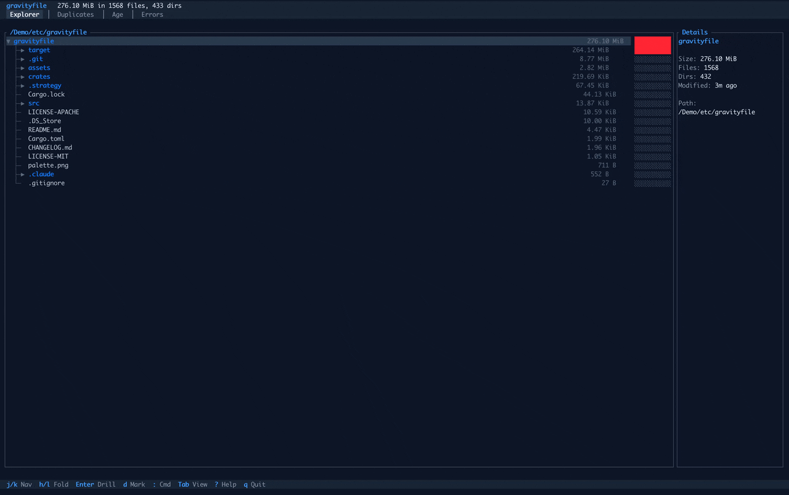

# gravityfile

[](LICENSE)
[](https://crates.io/crates/gravityfile)
[](https://ratatui.rs/)

> "Where mass accumulates, attention should follow."

**gravityfile** is a high-performance, file system explorer and analyzer. Built for modern terminal power users, it combines the speed of parallelized Rust with a visually stunning and highly intuitive TUI.



## 🚀 SOTA Performance

- **Parallel Scanning**: Traverses directories at ~500,000 files per second using `jwalk`.
- **Duplicate Hashing**: 3-phase BLAKE3 algorithm (Size -> Partial -> Full) to minimize I/O overhead.
- **Memory Optimization**: ~120MB per 1M nodes using `CompactString` and boxing strategies.
- **Asynchronous Architecture**: Non-blocking TUI using `tokio` and MPSC event loops.

## ✨ Core Features

- **Multi-View Navigation**: Seamlessly switch between **Tree**, **Miller Columns** (Ranger-style), and **Interactive Treemaps**.
- **Deep Analysis**: Integrated **Duplicate Finder** and **Age Distribution** reports.
- **Safe Operations**: Copy, move, and rename with a robust **Undo System**. Deletions default to system Trash.
- **Git Integration**: Real-time indicators for modified, staged, and untracked files.
- **Visual Mode**: Vim-style range selection (`V`) and bulk operations.
- **Extensible Plugin System**: Customize functionality using **Lua**, **Rhai**, or **WASM** (via Extism).
- **Modern UI**: Full dark/light theme support, glassmorphism-inspired aesthetics, and smooth animations.

## 🔌 Plugin System

gravityfile is designed to be fully extensible. You can write your own hooks, actions, and previewers.

```lua
-- Respond to scan completion in Lua
function on_scan_complete(self, hook)
    gf.notify(string.format("Scan complete: %d files", hook.tree.stats.total_files))
end
```

See [**PLUGINS.md**](docs/PLUGINS.md) for the full API reference.

## 🛠️ Installation

### From crates.io

```bash
cargo install gravityfile
```

### From source

```bash
git clone https://github.com/epistates/gravityfile
cd gravityfile
cargo install --path .
```

This installs both `gravityfile` and the short alias `grav`.

## 📖 Documentation

- [**User Guide**](#tui-keybindings) - Essential keybindings and usage.
- [**Plugin Development**](docs/PLUGINS.md) - Extend gravityfile with Lua, Rhai, or WASM.
- [**Architecture Deep-Dive**](docs/ARCHITECTURE.md) - Understanding the technical design.

## ⌨️ TUI Keybindings

| Key | Action |
|-----|--------|
| `j`/`k` | Move Up/Down |
| `h`/`l` | Collapse/Expand |
| `Enter` | Drill Into Directory |
| `v` | Cycle Layout (Tree -> Miller -> Treemap) |
| `Space` | Mark Item |
| `V` | Visual Mode (Range Select) |
| `y`/`x`/`p` | Yank / Cut / Paste |
| `d` / `D` | Delete (Trash) |
| `Ctrl-z` | Undo Last Operation |
| `/` | Fuzzy Search |
| `:` | Command Palette |
| `?` | Show Help |

---

## 🏗️ Technical Stack

- **UI Framework**: [Ratatui](https://ratatui.rs/)
- **Runtime**: [Tokio](https://tokio.rs/)
- **Serialization**: [Serde](https://serde.rs/)
- **Hashing**: [BLAKE3](https://github.com/BLAKE3-team/BLAKE3)
- **Plugin Runtimes**: `mlua`, `rhai`, `extism` (WASM)

## ⚖️ License

Licensed under either of [Apache-2.0](LICENSE-APACHE) or [MIT](LICENSE-MIT) at your option.

---
*Built with ❤️ by the Epistates team.*
